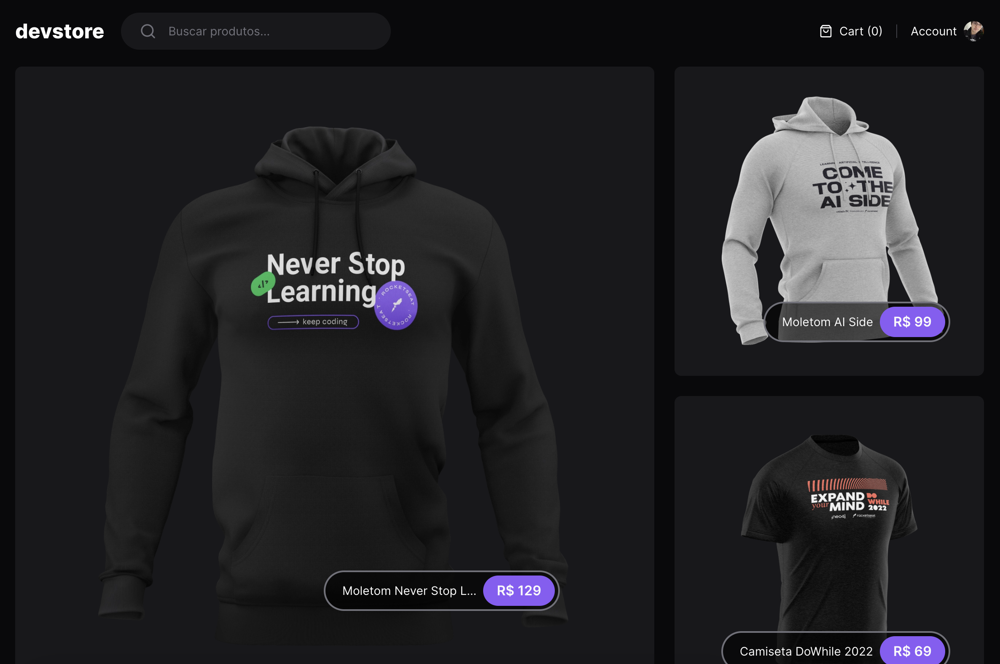
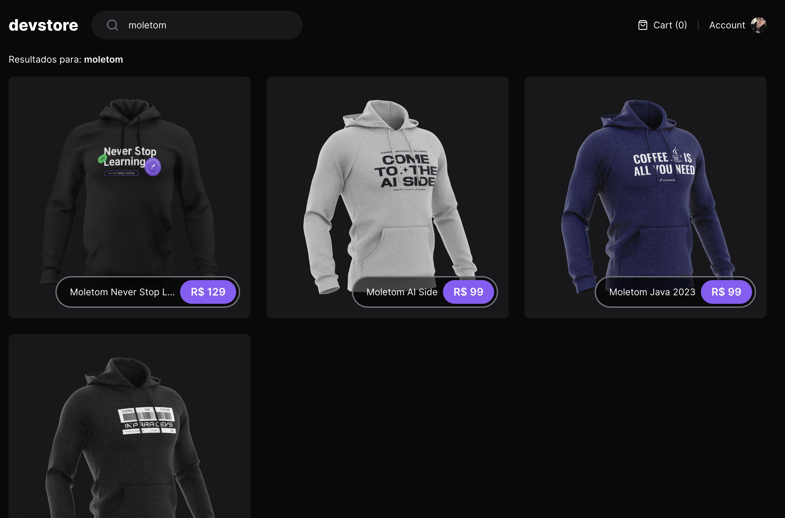

# Ignite - devstore

Este é um projeto de e-commerce simples desenvolvido com Next.js 13 e estilizado com Tailwind CSS. Ele serve como um exemplo de como utilizar a nova estrutura de App Folder do Next.js 13.

## Índice

- [Capturas de Tela](#capturas-de-tela)
- [Requisitos de Instalação](#requisitos-de-instalação)

## Capturas de Tela

<div align="center">
  <div style="display: flex; gap: 16px; align-items: center">
   
   
  </div>
</div>

## Requisitos de Instalação

Para executar o projeto, siga os passos abaixo:

```bash
1. Clone este repositório em sua máquina
$ git clone https://github.com/ViniciusPonte/devstore-ignite.git

2. Instale as dependencias
$ npm i

3. Rode o projeto através do comando:
$ npm run dev